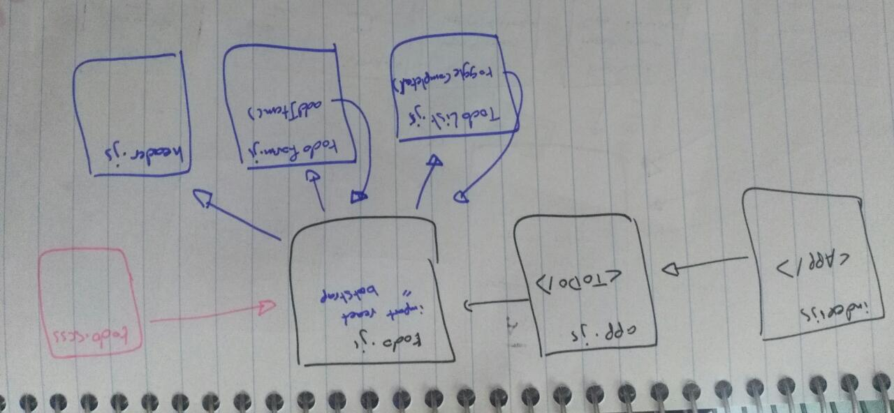

# todo

## Author : Israa Othman 

## Links :
  [lab31 PR](https://github.com/401-advanced-javascript-israaOthman/todo/pull/1)  
  [lab32 PR](https://github.com/401-advanced-javascript-israaOthman/todo/pull/2)  
  [lab33 PR](https://github.com/401-advanced-javascript-israaOthman/todo/pull/3)  

## How to initialize/run your application (where applicable)
  - `npm run start`  

## UML 
 
 
